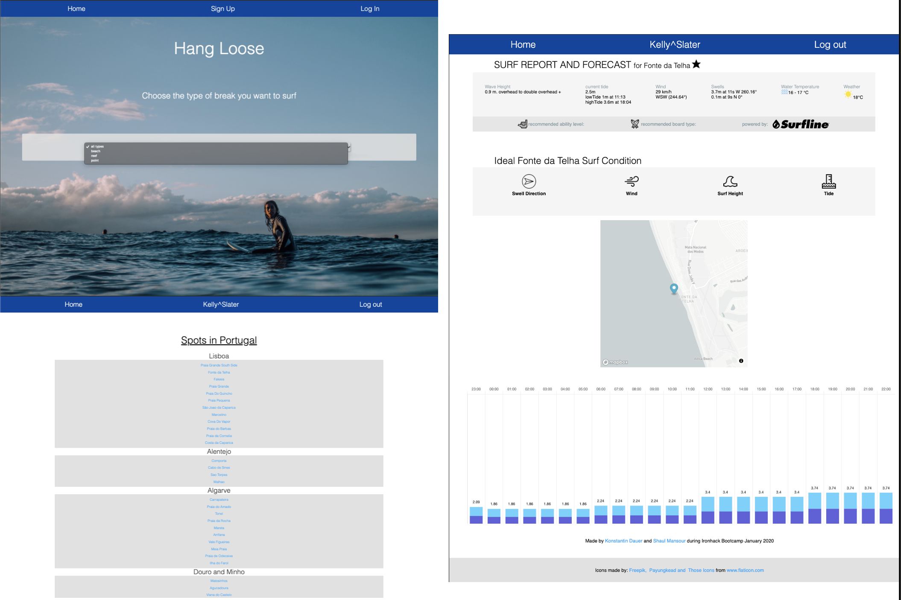

# Break Point
>  Ironhack bootcamp 2nd Project: Full stack Express application</br>
<table>
<tr>
<td>
  A webapp using the Surfline API and the Surfline-Legacy API to display a live surf report and forecast for surfspots filtered by break-type and geographic region.
</td>
</tr>
</table>

## Demo
Here is the working live demo : http://break-point-app.herokuapp.com/
## Table of contents
* [General info](#general-info)
* [Screenshots](#screenshots)
* [Technologies](#technologies)
* [Setup](#setup)
* [Features](#features)
* [Status](#status)
* [Inspiration](#inspiration)

## General info
The first step if you wanna go surfing is to check the weather conditions.</br>
The second thing you want to know is **how** the waves will *break*.</br>
**Break Point** allows surfers to filter surfing spots by the type of *break* and see live weather information and surfing conditions in the spot.
</br>Surf's On! :ocean:

## Screenshots


## Technologies and Dependencies
* scss
* node.js -v 12.13.1
* express.js -v 4.16.3
* handlebars -v 4.1.1
* mongoDB -v 3.2.0 /mongoose -v 5.2.10
* passport -v 0.4.1
* axios -v 0.19.2
* bcrypt -v 3.0.8
* chart.js
* mapbox

## Setup
#### Prerequisites
Install [MongoDB](https://docs.mongodb.com/manual/installation/)</br>
and optionally the MongoDB GUI [MongoDB Compass](https://docs.mongodb.com/compass/master/install/)

#### Installtion
* Fork this repository
* Clone this repository:
```
$ git clone https://github.com/kdauer/breakpoint.git
```
Install npm packages:
```
$ npm install
```
Create an .env file in the main folder and declare port to "Go Live" in local host.
```
$ touch .env
```
`PORT=8080`
#### Seeding of static data
1. Uncomment code in `bin/seeds.js`</br>
2. Run to create the DB and seed the spots collection:
```
$ node bin/seeds.js
```
3. comment out code in `bin/seeds.js` to avoid reseeding</br> 
If you now go to [MongoDB Compass](https://docs.mongodb.com/compass/master/install/), you should see the collection and spot data.
#### Launching Break Point
```
$ npm start
```

## Features
* Filter spots by break
* Choose beaches in Portugal by region
* See live weather information and surfing conditions in the spot
* Sign up and login to create a user 
* Add spots to your favorites and view in user page 
To-do list:
* Add more countries

## Status
Project is: _no longer continue_ as it was a limited project for the bootcamp

## Inspiration
Project inspired by [Magicseeweed](https://magicseaweed.com/) and [surfline](https://www.surfline.com/) </br>
App made with [Irongenerator](https://www.npmjs.com/package/ironhack_generator) - use the ironhack_generator in order to create express projects quickly.
